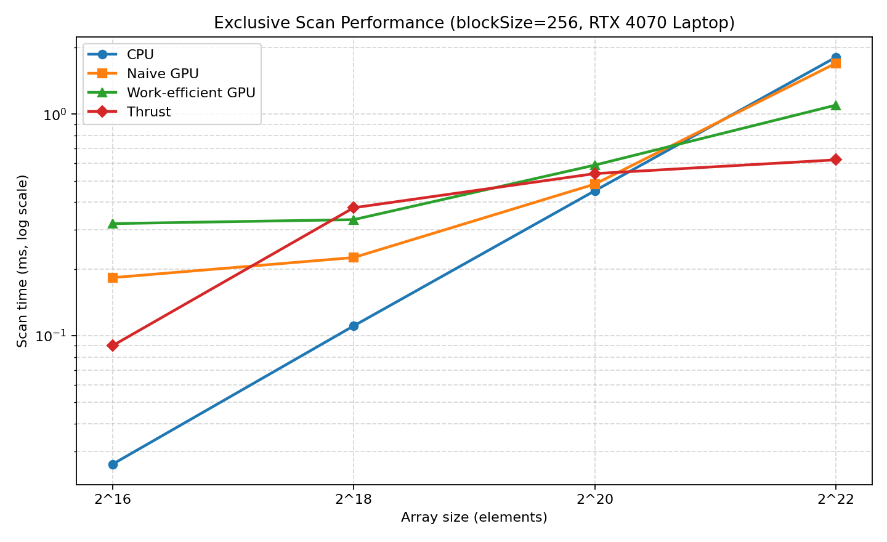

CUDA Stream Compaction
======================

**University of Pennsylvania, CIS 5650: GPU Programming and Architecture, Project 2**

* Nikita Lopatenko
* Tested on: Windows 11, Intel Core i7-13620H @ 2.40GHz, 32GB RAM, NVIDIA GeForce RTX 4070 Laptop GPU 8GB (sm_89), CUDA 13.1 (personal laptop)

### Features

* CPU exclusive scan, compaction without scan, and compaction with scan + scatter
* Naive GPU scan (doubling steps, ping-pong buffers, then convert to exclusive)
* Work-efficient GPU scan (upsweep / downsweep, pad to next power of two for NPOT), with Part 5 thread packing
* Work-efficient GPU stream compaction (map to 0/1 → scan → scatter)
* Thrust exclusive scan, mostly so I can compare against a library baseline

### Build notes (Windows)

I had to tweak `CMakeLists.txt` a bit for this laptop:

* CUDA toolkit includes for the test executable (otherwise MSVC could not find `cuda.h`)
* `CUDA_ARCHITECTURES` set to `89` for the RTX 4070 Laptop
* Fixed a small typo in `stream_compaction/CMakeLists.txt` (`stream_compaction}` → `stream_compaction`)

Built with CMake + Ninja, VS 2022 MSVC, Release.

---

## Performance analysis

All numbers are from Release builds. GPU timers do not include the initial/final `cudaMalloc` or host to device copies for meaningful measurements. The scan table is for power-of-two sizes.

### Block size

I tried a few block sizes at `N = 2^22` (4,194,304 elements):

| blockSize | Naive scan (ms) | Work-efficient scan (ms) |
|-----------|-----------------|--------------------------|
| 128 | 1.761 | 1.125 |
| 256 | 1.690 | 1.245 |
| 512 | 1.792 | 1.235 |

Naive stays at `blockSize = 256` (best in that table). After Part 5 tuning I set work-efficient to `blockSize = 128` (best for Efficient above). The size-sweep table below was measured earlier with Efficient at 256; the Extra Credit section has a newer CPU vs Efficient check with the packed / block-128 version.

### Scan time vs array size (`blockSize = 256`)

| N | CPU (ms) | Naive (ms) | Work-efficient (ms) | Thrust (ms) |
|---|----------|------------|---------------------|-------------|
| 2^16 (65,536) | 0.026 | 0.183 | 0.320 | 0.090 |
| 2^18 (262,144) | 0.111 | 0.225 | 0.334 | 0.378 |
| 2^20 (1,048,576) | 0.451 | 0.483 | 0.588 | 0.539 |
| 2^22 (4,194,304) | 1.806 | 1.697 | 1.098 | 0.622 |



### Discussion

* **Small N:** for this, CPU wins. Instead of paying for kernel launches, lots of upsweep/downsweep calls, etc., the CPU just does very simple math with basically no GPU-style setup cost.
* **Large N:** Thrust is fastest, then work-efficient, then naive, then CPU, which is exactly what I expected. Work-efficient does `O(n)` work compared to the `O(n log n)` additions in naive, and also fewer full-array ping-pong passes. Thrust is a really well-tuned NVIDIA library implementation, so it would be pretty surprising if my version beat it — they probably use better launch patterns and shared memory tricks.
* **Bottlenecks:** a lot of this looks memory-bound (reading/writing big `int` arrays) plus launch overhead. Naive especially pays for `log n` wide passes; efficient pays for many separate levels; Thrust seems to amortize that better. For the timed Thrust region I only call `exclusive_scan` on device vectors (host↔device setup is outside the timer), so the measurement is mostly their scan kernels, not my copies.

### Extra Credit — Part 5 (thread packing)

My work-efficient implementation uses the packed indexing discussed in Part 5. At each deeper upsweep/downsweep level, only half as many tree nodes are active. Giving this work consecutive thread IDs keeps it together in the first blocks instead of spreading active and idle threads across a full-size grid.

The binary-tree scan is stored in a flat array. For level step `d`, thread `i` (packed, `i = 0 .. n/(2d)-1`) owns one node pair:

* left child index: `i * (2d) + d - 1`
* right child index: `i * (2d) + 2d - 1`

The host loops calculate `usedThreads = n/(2d)` and launch only `ceil(usedThreads / blockSize)` blocks. Later blocks are not launched at all, which is the “free whole blocks so they can do other work” idea from class.

This still does not remove the overhead of running separate kernels for every tree level. That is why CPU remains faster for small and medium arrays. At a large enough size, the parallel work makes up for that overhead. I also set Efficient’s block size to 128, which was its best result in the block-size test. A Release spot check at `N = 2^22` gave:

| | Time (ms) |
|--|-----------|
| CPU scan | 1.615 |
| Work-efficient scan (packed, block 128) | 1.237 |

So on this large size, optimized Efficient beats CPU.

---

## Test program output (`SIZE = 1 << 20`)

```
****************
** SCAN TESTS **
****************
    [  20   2   1  47  28  15  47  33  33  14   8   9   5 ...  14   0 ]
==== cpu scan, power-of-two ====
   elapsed time: 0.4105ms    (std::chrono Measured)
    [   0  20  22  23  70  98 113 160 193 226 240 248 257 ... 25695967 25695981 ]
==== cpu scan, non-power-of-two ====
   elapsed time: 0.4225ms    (std::chrono Measured)
    [   0  20  22  23  70  98 113 160 193 226 240 248 257 ... 25695879 25695922 ]
    passed
==== naive scan, power-of-two ====
   elapsed time: 0.570304ms    (CUDA Measured)
    passed
==== naive scan, non-power-of-two ====
   elapsed time: 0.446944ms    (CUDA Measured)
    passed
==== work-efficient scan, power-of-two ====
   elapsed time: 0.577152ms    (CUDA Measured)
    passed
==== work-efficient scan, non-power-of-two ====
   elapsed time: 0.593792ms    (CUDA Measured)
    passed
==== thrust scan, power-of-two ====
   elapsed time: 0.531456ms    (CUDA Measured)
    passed
==== thrust scan, non-power-of-two ====
   elapsed time: 0.400384ms    (CUDA Measured)
    passed

*****************************
** STREAM COMPACTION TESTS **
*****************************
    [   2   2   1   3   0   3   3   3   1   0   0   1   3 ...   0   0 ]
==== cpu compact without scan, power-of-two ====
   elapsed time: 2.1809ms    (std::chrono Measured)
    [   2   2   1   3   3   3   3   1   1   3   2   1   1 ...   3   3 ]
    passed
==== cpu compact without scan, non-power-of-two ====
   elapsed time: 2.1281ms    (std::chrono Measured)
    [   2   2   1   3   3   3   3   1   1   3   2   1   1 ...   3   3 ]
    passed
==== cpu compact with scan ====
   elapsed time: 4.6515ms    (std::chrono Measured)
    [   2   2   1   3   3   3   3   1   1   3   2   1   1 ...   3   3 ]
    passed
==== work-efficient compact, power-of-two ====
   elapsed time: 0.67824ms    (CUDA Measured)
    passed
==== work-efficient compact, non-power-of-two ====
   elapsed time: 0.669536ms    (CUDA Measured)
    passed
```
